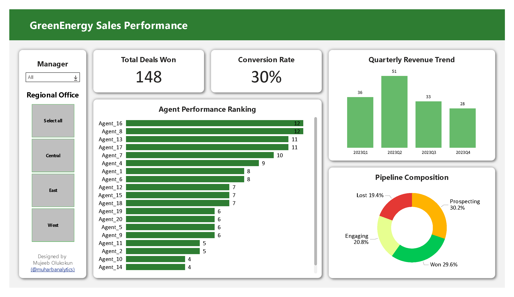

# End-to-End Sales Pipeline & Automated Performance Tracker for GreenEnergy Solutions.

## Table of Contents
* [Business Introduction](#business-introduction)
* [Business Problem](#business-problem)
* [Description & Dashboard](#description--dashboard)
* [Data Sources & Tools](#data-sources--tools)
* [The Process (Automation & Analysis)](the-process-automation--analysis)
* [Insights & Strategic Value](#insights--strategic-value)
* [References & Code Snippets](#references--code-snippets)
---
## Business Introduction
**GreenEnergy Solutions** specializes in residential solar installations. The sales team manages a complex pipeline ranging from initial prospecting to final contract signing.

## Business Problem
The company recently adopted a new CRM to track leads (Prospecting, Site Visit, Contract, Installed) but lacks visibility into sales agent efficiency and regional performance outside the platform. This project solves that problem by replacing static manual reporting with an automated intelligence framework.

**Key Pain Points:**
* The sales manager cannot view aggregated quarterly trends.
* The manager cannot filter performance by specific regional offices.
* Raw data contains missing values in deal stages, particularly for early-stage prospects like "engaging" or "prospecting" where close dates are naturally absent.

**Project Aim:**
* The objective is to enable the sales manager to track the team's performance, automate data preparation, and rank sales agents by revenue generation through a dynamic dashboard.

  - **Automate Data Prep:** Programmatically handle missing values and merge disparate datasets (Sales Pipeline and Sales Teams).
  - **Track KPI Growth:** Monitor opportunities won and calculate quarter-over-quarter growth using scorecard visuals.
  - **Agent Performance:** Rank sales agents by closed deals to identify top performers and those that needs coaching.
---

## Description & Dashboard
This project creates an interactive, dynamic dashboard to track quarterly sales performance for a residential solar energy provider. Unlike standard manual reporting, this project utilizes Python for automated data cleaning and anomaly detection before visualizing results in an interactive interface.


*Figure 1: The final interactive dashboard showing Q1-Q4 performance, agent rankings, and regional filters.*

---

## Data Sources & Tools
**Data:**
* `solar_pipeline.csv`: Contains Opportunity IDs, Sales Agent names, System Size, Deal Stage, and Close Values.
* `sales_teams.csv`: Contains Manager names and Regional Office assignments.

**Tools:**
* **Python (Pandas):** For data cleaning, merging, and automated quality assurance.
* **Power BI:** For creating the dynamic dashboard and DAX calculations.
* **GitHub:** For version control and documentation.

---
## The Process (Automation & Analysis)
This project advances beyond basic spreadsheet manipulation by implementing an automated pipeline:

**1. Automated Data Profiling & Cleaning:** Instead of manually checking column stats for empty cells, a Python script ingests the raw CSVs. It automatically flags logic errors, such as "Won" deals missing a "Close Date" or "Close Value", and handles expected nulls for "Prospecting" deals.

**2. Data Merging:** To associate agents with their managers, I replaced the manual XLOOKUP method with a robust Python left-join merge. This ensures that every sales agent is correctly mapped to their Regional Office and Manager without the risk of broken formula references.

```python
# Merging Sales Pipeline with Team Data
df_merged = pd.merge(
    pipeline_df,
    teams_df,
    on='sales_agent',
    how='left'
)
# Validating the merge to ensure no agents were dropped
print(f"Total rows after merge: {len(df_merged)}")
```
**3. Metric Calculation (DAX):** I used Data Analysis Expressions (DAX) to create dynamic analysis measures to show:
* *Quarterly Trends:* Grouping data by closing date quarters (Q1–Q4) to visualize seasonal dips or spikes.
* *Win/Loss Ratios:* Calculating the percentage of "Won" vs. "Lost" opportunities per quarter to track conversion efficiency.
* *Agent Rankings:* Sorting agents by total opportunities won in descending order to isolate the highest revenue generators.

```DAX
# Measures created using DAX
Conversion Rate = DIVIDE([Deals Won], COUNTROWS('processed_sales_data'), 0)
Deals Won = CALCULATE(COUNTROWS('processed_sales_data'), 'processed_sales_data'[deal_stage] = "Won")
Deals Won Last Qtr = CALCULATE([Deals Won], DATEADD('processed_sales_data'[close_date], -1, QUARTER))
```

**4. Dashboard Construction:** The final visual layer includes:
* *Scorecards:* Displaying current Q4 performance against Q3 baselines with absolute change indicators.
* *Slicers:* Adding interactivity to allow the manager to filter the entire report by Regional Office (e.g., "West") or Manager Name.
* *Visual Hierarchy:* Using a bar chart for agent performance and a pie chart for overall win/loss percentages, sorted so the "Won" slice is emphasized.<br/>

[Interactive Dashboard](https://app.powerbi.com/groups/me/reports/89e9e26f-30c9-4105-9794-3f70e028b3dc/01a393b78e95e015e9c8?experience=power-bi)

---

## Insights & Strategic Value
* **Findings:**
  - **Seasonal Volatility:** Similar to the source data, GreenEnergy saw a drop in volume during Q4, likely due to seasonal installation constraints, closing 61 fewer deals than in Q3.
  - **Regional Disparities (The "West" Problem):** The **West Region** underperformed the Central Region by 22% in total closed revenue. While the West generated high "Prospecting" volume, it had the highest "Lost" rate at the "Contract" stage.
  - **Top Talent:** The top sales agent consistently outperformed the lowest quartile by a factor of 2:1, suggesting a need for peer-to-peer mentorship.

* **Recommendations:**
  - **Regional Focus:** Use the dashboard slicers to identify which Regional Office (West vs. Central) has the highest "Lost" rate and investigate local competitor pricing.
  - **Pipeline Management:** To mitigate the Q4 seasonal dip next year, front-load "Site Visits" in October/November.
  - **Training:** Managers should focus coaching on agents with high "Engaging" volume but low "Close" rates.
 
---
## References & Code Snippets

*Automated Quarter Extraction:*
```python
# Converting Close Date to Datetime and extracting Quarter
df_merged['close_date'] = pd.to_datetime(df_merged['close_date'])
df_merged['quarter'] = df_merged['close_date'].dt.to_period('Q')
```

*Methodology:*
[Inspired by the Maven Analytics "CRM Sales Dashboard" guided project](https://www.youtube.com/watch?v=qfCjuANADlU)
  
